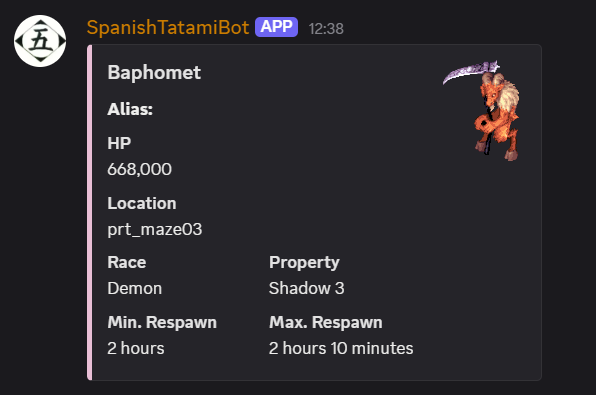
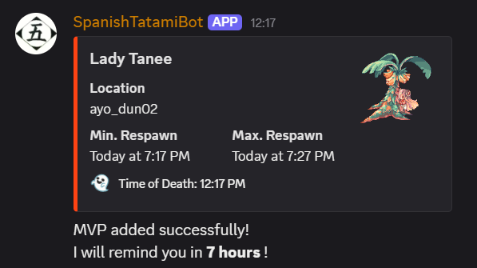
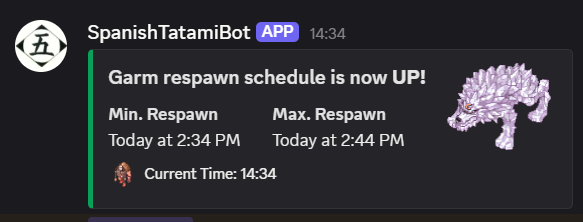
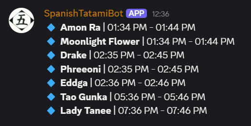

# 🎮 Spanish Tatami MVP Tracker Discord Bot

**Spanish Tatami** es un bot para Discord especializado en el tracking de MVPs (Most Valuable Players) para Ragnarok Online, diseñado específicamente para jugadores españoles que juegan en servidores brasileños (ROLatam).

## ⭐ Características Principales

- 📊 **Información detallada de MVPs** basada en RMS (Rate My Server)
- 📝 **Lista de seguimiento personalizada** de MVPs activos
- ⏰ **Conversión automática de horarios** Brasil ↔ España
- 🔔 **Recordatorios automáticos** con avisos de 5 minutos y respawn
- 🌐 **Soporte multizona horaria** para servidores brasileños

## 🕒 Sistema de Horarios

El bot maneja automáticamente la conversión entre:
- **Hora del Servidor** (Brasil - GMT-3)
- **Hora Local** (España - GMT+1/+2)

Cuando introduces una hora, el bot la interpreta como **hora del servidor** y automáticamente calcula y muestra la hora española equivalente.

## 📋 Comandos Disponibles

### Comandos Básicos
```
$help                           # Ver todos los comandos
$info <nombre_mvp>             # Información de un MVP específico
$mvp list                      # Lista de MVPs en seguimiento
$mvp clear                     # Limpiar lista (solo tras reinicio server)
$set-reminder-channel          # Configurar canal de recordatorios
```

### Comando Principal
```
$mvp add <nombre_mvp> [HH:MM]
```

## 📖 Guía de Uso Detallada

### 🔍 `$help`
Muestra una lista completa con todos los comandos disponibles del bot.

### 📊 `$info <nombre_mvp>`


Muestra información detallada de un MVP específico:
- HP, Raza, Elemento
- Ubicación en el mapa
- Tiempos de respawn mínimo y máximo
- Alias disponibles

**Ejemplos:**
```
$info Amon Ra
$info Baphomet
$info GTB
```

### ➕ `$mvp add <nombre_mvp> [HH:MM]`


Agrega un MVP a la lista de seguimiento. Funciona de dos maneras:

#### Modo 1: Hora Actual
```
$mvp add Orc Lord
```
- Usa la hora española actual como tiempo de muerte
- Calcula respawn basado en la hora actual

#### Modo 2: Hora Personalizada
```
$mvp add Orc Lord 21:30
```
- Interpreta `21:30` como **hora del servidor** (Brasil)
- Convierte automáticamente a hora española
- Muestra ambos horarios en el resultado

**Resultado del comando:**
- **Hora de la Muerte:** `21:30 (Server) = 02:30 (España)`
- **Min. Respawn:** `23:30 (Server) / 04:30 (España)`
- **Max. Respawn:** `23:40 (Server) / 04:40 (España)`



### 📋 `$mvp list`


Muestra todos los MVPs actualmente en seguimiento con sus horarios de respawn en **hora española**.

**Formato de salida:**
```
🔹 **Orc Lord** | 04:30 - 04:40
🔹 **Baphomet** | 05:15 - 05:25
```

### 🧹 `$mvp clear`
Elimina todos los MVPs de la lista de seguimiento.

> ⚠️ **IMPORTANTE:** Este comando solo debe usarse cuando el servidor haya tenido un **reinicio** (caída, mantenimiento, etc.), ya que esto resetea todos los MVPs del juego.

### 🔔 `$set-reminder-channel`
Configura el canal actual para recibir recordatorios automáticos. El bot enviará notificaciones cuando:
- **5 minutos antes** del respawn: "⚠️ Faltan 5 min. para que respawnee **[MVP]** ⚠️"
- **En el momento del respawn**: "El MVP [MVP] va a respawnear **¡YA!**"

## 🎯 Ejemplos de Uso Común

### Scenario 1: MVP recién matado
```
$mvp add Pharaoh 20:45
```
**El bot responde:**
- Hora de muerte: `20:45 (Server) = 01:45 (España)`
- Respawn: `21:45 (Server) / 02:45 (España)`

### Scenario 2: Consultar MVP
```
$info Pharaoh
```
**Muestra:** HP, ubicación, tiempo de respawn (1 hora), etc.

### Scenario 3: Ver lista activa
```
$mvp list
```
**Muestra todos los MVPs** en seguimiento con horarios españoles.

## 🛠️ Instalación y Configuración

### Requisitos
- Node.js (v14 o superior)
- Token de bot de Discord
- Permisos de bot en tu servidor Discord

### Configuración
1. Clona el repositorio
2. Instala dependencias: `npm install`
3. Configura tu token en archivo `.env`
4. Ejecuta: `npm start`

### Permisos del Bot
- Leer mensajes
- Enviar mensajes
- Insertar enlaces
- Usar emojis externos
- Mencionar @everyone (para alertas)

## 📸 Capturas de Pantalla

| Comando | Resultado |
|---------|-----------|
| `$info` |  |
| `$mvp add` |  |
| `$mvp list` |  |
| Recordatorio |  |

## 🤝 Contribuir

¿Encontraste un bug o tienes una sugerencia? 
- 🐛 [Reportar Issues](../../issues)
- 🔧 [Pull Requests](../../pulls)
- 💬 Contáctame en Discord

## 📝 Notas Importantes

- ⏰ **Horarios:** El bot maneja automáticamente cambios de horario de verano/invierno
- 🌍 **Zona horaria:** Optimizado para jugadores españoles en servidores brasileños
- 💾 **Persistencia:** Los datos se guardan automáticamente cada 30 segundos
- 🔄 **Actualizaciones:** El bot verifica respawns cada segundo para máxima precisión

## 📜 Créditos

> **Spanish Tatami MVP Tracker Discord Bot** está basado en Sprinkles de 🌺 Xaikyu 🌺#3108 y Jeee#0016, actualizado, mejorado y traducido por **Sarjador**.

### Mejoras Implementadas
- ✅ Conversión automática de horarios Brasil-España
- ✅ Soporte para horarios personalizados
- ✅ Interfaz completamente en español
- ✅ Sistema de recordatorios mejorado
- ✅ Manejo robusto de zonas horarias

---

⭐ **¿Te gusta el bot?** ¡Dale una estrella al repositorio y compártelo con tu guild!

📧 **Soporte:** Para dudas o problemas, abre un [Issue](../../issues) en GitHub.
